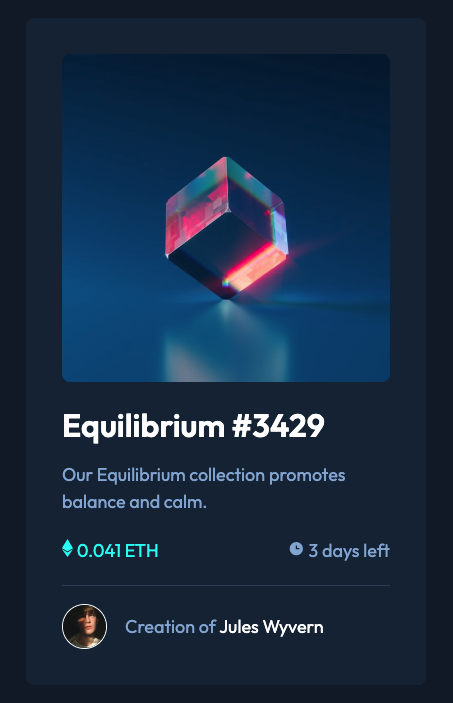

# Frontend Mentor - NFT preview card component solution

This is a solution to the [NFT preview card component challenge on Frontend Mentor](https://www.frontendmentor.io/challenges/nft-preview-card-component-SbdUL_w0U). Frontend Mentor challenges help you improve your coding skills by building realistic projects.

## Table of contents

- [Overview](#overview)
  - [The challenge](#the-challenge)
  - [Screenshot](#screenshot)
  - [Links](#links)
- [My process](#my-process)
  - [Built with](#built-with)
  - [What I learned](#what-i-learned)
- [Author](#author)

## Overview

### The challenge

Users should be able to:

- View the optimal layout depending on their device's screen size
- See hover states for interactive elements

### Screenshot



### Links

[Solution URL](https://github.com/codercreative/nft-preview-card)

## My process

### Built with

- Semantic HTML5 markup
- CSS custom properties
- Flexbox
- Mobile-first workflow

### What I learned

The overlay posed a bit of a challenge. The overlay did not exactly match the dimensions of the image, so I solved it with a "hacky" solution (for now...)

```css
.overlay {
  background-color: rgba(0, 255, 248, 0.5);
  opacity: 0;
  position: absolute;
  border-radius: 8px;

  top: 0;
  bottom: 22px;
  left: 0;
  right: 0;

  display: flex;
  align-items: center;
  justify-content: center;

  transition: 0.5s ease;
}
```

## Author

- Frontend Mentor - [@codercreative](https://www.frontendmentor.io/profile/codercreative)
